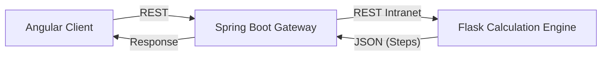

# Calculato Spring Boot API — Mathematical Tools Platform


> Educational platform designed for engineering students, focused on step-by-step resolution of calculus and mathematical analysis problems.

## About the Project
This project originates from the need for a free, detailed, and diverse set of calculation tools for engineering students. Unlike standard calculators, this platform not only provides the final result but also breaks down the logical procedure (derivatives, integrals) to support learning.

This repository contains the API Gateway. To view the Frontend source code, [click here](https://github.com/Sande-Ricardo/calculator-1.0). To view the Python calculation engine, [click here](https://github.com/Sande-Ricardo/calculato-microservice).

## System Architecture
The system follows a **Hybrid Microservices** architecture to leverage the strengths of each language:

* **Frontend (Angular):** SPA (Single Page Application) responsible for rendering mathematical formulas and interactive plots.
* **API Gateway / Orchestrator (Spring Boot):** Handles requests, validations, and business logic. Acts as a security layer and central entry point.
* **Calculation Engine (Flask/Python):** Microservice dedicated exclusively to intensive mathematical computation (using `SymPy` and `NumPy`).

### Communication Diagram


### Features
+ Derivative Calculator: Step-by-step results using differentiation rules.
+ Integral Calculator: Supports definite and indefinite integrals.
+ Function Visualizer: Interactive plots rendered on the client.

### Prerequisites
+ Java 17+
+ Python 3.9+
+ Node.js & Angular CLI

#### 1. Calculation Engine (Python)
``` bash
cd calculato_microservice
pip install -r requirements.txt
python app.py
# Runs on port: 5000	
```
#### 2.Backend Gateway (Spring Boot)
``` bash
cd calculato-rest_api 
./mvnw spring-boot:run
# Runs on port: 8080
```
#### 3. Frontend (Angular)
``` bash
cd calculator-1.0 
npm install
ng serve
# Access at: http://localhost:4200
```

### Future Improvements
+ Additional Tools:
  + Statical utilities
  + Unit and magnitude converter
+ Rate Limiting support
+ Database + Caching integration
+ Engineering course module by subject
+ Authentication module

###End

